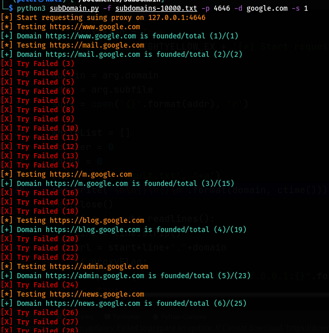

# subDomainFinder
python script for finding the hidden subdomains in a web server 

for using the script :
<code> 
  python3 -f [your subdomain file ] -p [proxy port] -d [main doamin server ] -s [0 (for using http) or 1 (for using https)]
  </code>
  
 program using proxy :
 
 
